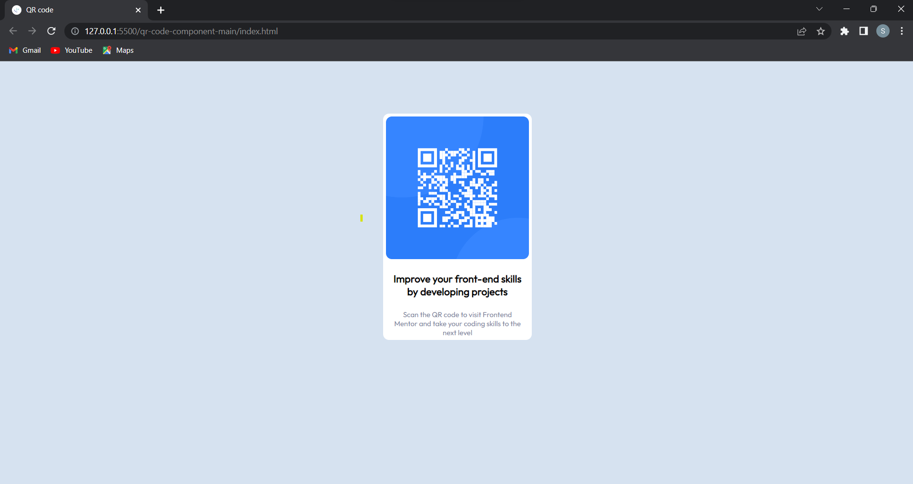

# Frontend Mentor - QR code component solution

  

This is a solution to the [QR code component challenge on Frontend Mentor](https://www.frontendmentor.io/challenges/qr-code-component-iux_sIO_H). This is to improve my coding skills by building realistic projects.

  

## Table of contents

  

- [Overview](#overview)

  - [Screenshot](#screenshot)

  - [Links](#links)

- [Author](#author)

  

  

## Overview

  Created a QR code component using CSS grid and Flex

### Screenshot

  

  

This is the screenshot of your solution.

  
Then crop/optimize/edit your image however you like, add it to your project, and update the file path in the image above.

  

### Links

  

- Solution URL: [Add solution URL here](https://github.com/subhajitchatterjee07/QR-code-component-using-CSS-grid-and-flexbox)

- Live Site URL: [Add live site URL here](https://subhajitchatterjee07.github.io/QR-code-component-using-CSS-grid-and-flexbox/)

  

  

### Built with

  

- Semantic HTML5 markup

- CSS custom properties

- Flexbox

- CSS Grid

  

  

### What I learned

  

Use this section to recap over some of your major learnings while working through this project. Writing these out and providing code samples of areas you want to highlight is a great way to reinforce your own knowledge.

  

  

  

### Useful resources

  

- [Example resource 1](https://www.w3schools.com) - This helped me for gaining deeper understanding of Grid and Flexbox. I really liked this pattern and will use it going forward.

  

  

## Author

  
Subhajit Chatterjee

  
